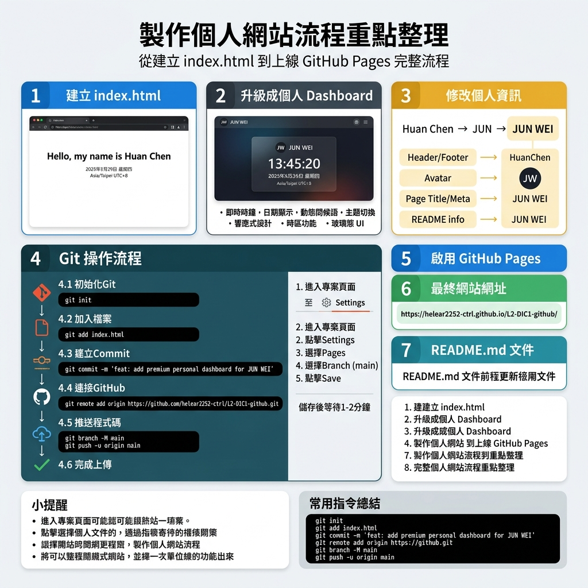

# 📓 工作日誌 — 個人網站製作紀錄

**專案名稱**：JUN WEI 個人時鐘儀表板  
**專案網址**：[https://helear2252-ctrl.github.io/L2-DIC1-github/](https://helear2252-ctrl.github.io/L2-DIC1-github/)  
**GitHub 儲存庫**：[https://github.com/helear2252-ctrl/L2-DIC1-github](https://github.com/helear2252-ctrl/L2-DIC1-github)  
**日期**：2026年5月29日

---

## 📊 製作流程重點整理



---

## 📋 工作摘要

### ✅ 步驟一：建立 index.html
- 建立一個展示個人資訊的網頁
- 顯示：Hello、我的名字（JUN WEI）、目前日期、目前時間

### ✅ 步驟二：升級為個人 Dashboard
- 加入即時時鐘、日期顯示、動態問候語
- 新增主題切換、響應式設計、時區功能
- 採用玻璃態 UI（Glassmorphism）設計風格

### ✅ 步驟三：修改個人資訊
- 名稱修改流程：`Huan Chen` → `JUN` → `JUN WEI`
- 同步修改項目：Header / Footer、Avatar (JW)、Page Title / Meta、README 資訊

### ✅ 步驟四：Git 操作流程

```bash
# 初始化本地 Git 儲存庫
git init

# 加入檔案至暫存區
git add index.html

# 建立版本記錄
git commit -m "feat: add premium personal dashboard for JUN WEI"

# 連接遠端 GitHub 儲存庫
git remote add origin https://github.com/helear2252-ctrl/L2-DIC1-github.git

# 推送程式碼至 GitHub main 分支
git branch -M main
git push -u origin main
```

### ✅ 步驟五：啟用 GitHub Pages
1. 進入 GitHub 專案頁面
2. 點擊 **Settings** → **Pages**
3. 選擇 Branch：`main`
4. 點擊 **Save**，等待 1–2 分鐘即部署完成

### ✅ 步驟六：最終網站網址
🌐 **[https://helear2252-ctrl.github.io/L2-DIC1-github/](https://helear2252-ctrl.github.io/L2-DIC1-github/)**

### ✅ 步驟七：建立 README.md
- 說明專案功能特色
- 記錄使用技術（HTML / CSS / JS）
- 附上 Live Demo 連結

---

## 💡 小提醒

- 修改內容後，記得 `git add` → `git commit` → `git push` 即可更新網站內容
- GitHub Pages 僅支援靜態網頁（HTML / CSS / JS）
- 網站更新後，可能需要等候幾秒鐘才能在瀏覽器顯示最新內容

---

## 📝 常用指令總結

| 指令 | 說明 |
|------|------|
| `git init` | 初始化 Git 儲存庫 |
| `git add .` | 加入所有變更檔案 |
| `git commit -m "message"` | 建立版本記錄 |
| `git remote add origin <url>` | 連接遠端儲存庫 |
| `git branch -M main` | 設定主分支名稱 |
| `git push -u origin main` | 推送至遠端 |
